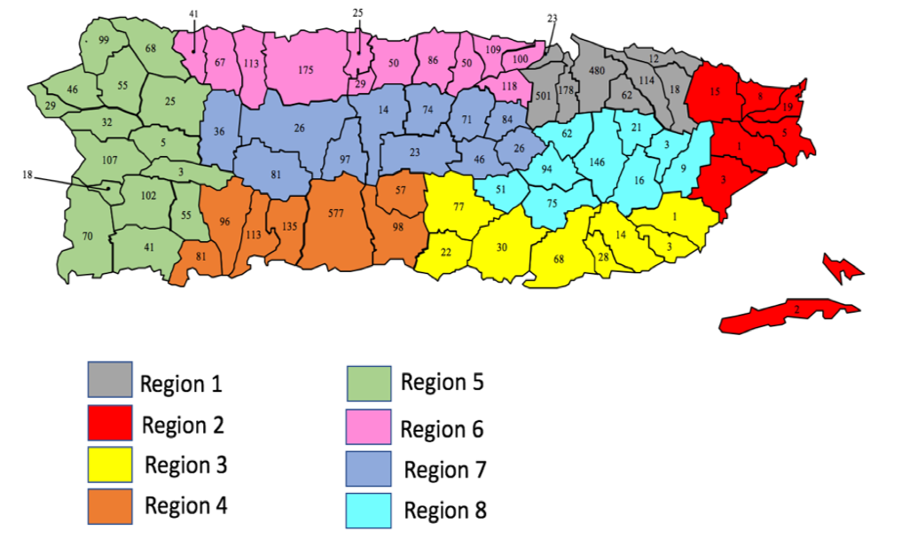

# [Summary](https://nextstrain.org/community/grubaughlab/ZIKV-PR?r=region-in-PR)

* Zika virus genomes (>70% CDS) from Puerto Rico = 82
We did not use Zika virus genomes from Puerto Rico produced by other groups as we did not have precise location information.
* Total number of Zika virus genomes in the build = 458
USVI genomes are unpublished from Trevor Bedford’s group

<figure class="image"><figcaption>Regional divisions within Puerto Rico for epidemiological data aggregation.</figcaption>

# [Molecular clock](https://nextstrain.org/community/grubaughlab/ZIKV-PR?c=region-in-PR&l=clock&r=region-in-PR)

Rate estimate = 8.88x10-4 subs/site/year  
[main ZIKV build](https://nextstrain.org/zika?l=clock) = 8.40x10-4 subs/site/year

# [All Zika virus genomes from Puerto Rico](https://nextstrain.org/community/grubaughlab/ZIKV-PR)

9 observed introductions  
2 large clades (Clade 1 and Clade 2 below)  
Origins: 
* Central America 5x (all likely from Honduras)
* South America 1x (Brazil likely)
* Caribbean 3x (USVI 1x, DR 2x)

# [Clade 1](https://nextstrain.org/community/grubaughlab/ZIKV-PR?c=region-in-PR&r=region-in-PR)
### December, 2015 to January, 2017
* 12 Zika virus genomes
* tMRCA = January, 2016 (95% CI, November, 2015 - February, 2016)
* Origin = Central America (Honduras 100%)
* Introduction = Region 4 - Ponce (96% Region 4, 3% Region 5, 1% Region 3)
Observed within PR spread events:
| Destination |   |    |    |    |    | Total O |
|:-----------:|:-:|:--:|:--:|:--:|:--:|:-------:|
|    Origin   |   |  3 |  4 |  5 |  7 |         |
|             | 3 | NA |  0 |  0 |  0 |    0    |
|             | 4 |  2 | NA |  3 |  1 |    6    |
|             | 5 |  0 |  0 | NA |  0 |    0    |
|             | 7 |  0 |  0 |  0 | NA |    0    |
|   Total D   |   |  2 |  0 |  3 |  1 |    0    |

# [Clade 2](https://nextstrain.org/community/grubaughlab/ZIKV-PR?c=region-in-PR&r=region-in-PR)

* tMRCA =  August 2015 (95% CI, July 2015 to November 2015)
* We cannot determine if the virus spread from Brazil to USVI or Puerto Rico first. If it was introduced in Puerto Rico first, then this clade would be larger and the tMRCA would have been in  February 2015 (95% CI December 2014 - May 2015).
* Origin =  USVI 76% (Puerto Rico 24%)
* Introduction = Region 2 - Fajardo (61% Region 2, 5% Region 3, 5% region 3. 29% St. Thomas, meaning it was introduced in August-November from USVI)

Observed within PR spread events:  
| Destination 	|      	|      	|    	|    	|    	|    	|    	|    	|    	|    	| Total O 	|
|:-----------:	|:----:	|:----:	|:--:	|:--:	|:--:	|:--:	|:--:	|:--:	|:--:	|:--:	|:-------:	|
|    Origin   	|      	| USVI 	|  1 	|  2 	|  3 	|  4 	|  5 	|  6 	|  7 	|  8 	|         	|
|             	| USVI 	|  NA  	|  0 	|  1 	|  0 	|  1 	|  0 	|  0 	|  0 	|  0 	|    2    	|
|             	|   1  	|   0  	| NA 	|  0 	|  0 	|  0 	|  1 	|  1 	|  0 	|  0 	|    2    	|
|             	|   2  	|   2  	|  1 	| NA 	|  3 	|  0 	|  2 	|  2 	|  3 	|  2 	|    15   	|
|             	|   3  	|   0  	|  1 	|  0 	| NA 	|  0 	|  2 	|  1 	|  2 	|  0 	|    6    	|
|             	|   4  	|   0  	|  0 	|  0 	|  0 	| NA 	|  0 	|  0 	|  0 	|  0 	|    0    	|
|             	|   5  	|   0  	|  2 	|  2 	|  1 	|  2 	| NA 	|  2 	|  0 	|  2 	|    11   	|
|             	|   6  	|   0  	|  1 	|  0 	|  0 	|  1 	|  0 	| NA 	|  0 	|  1 	|    3    	|
|             	|   7  	|   0  	|  1 	|  0 	|  0 	|  0 	|  0 	|  0 	| NA 	|  1 	|    2    	|
|             	|   8  	|   0  	|  0 	|  0 	|  0 	|  0 	|  0 	|  0 	|  0 	| NA 	|    0    	|
|   Total D   	|      	|   2  	|  6 	|  3 	|  4 	|  4 	|  5 	|  6 	|  5 	|  6 	|    41   	|. 

<!-- STYLES TO APPLY -->

